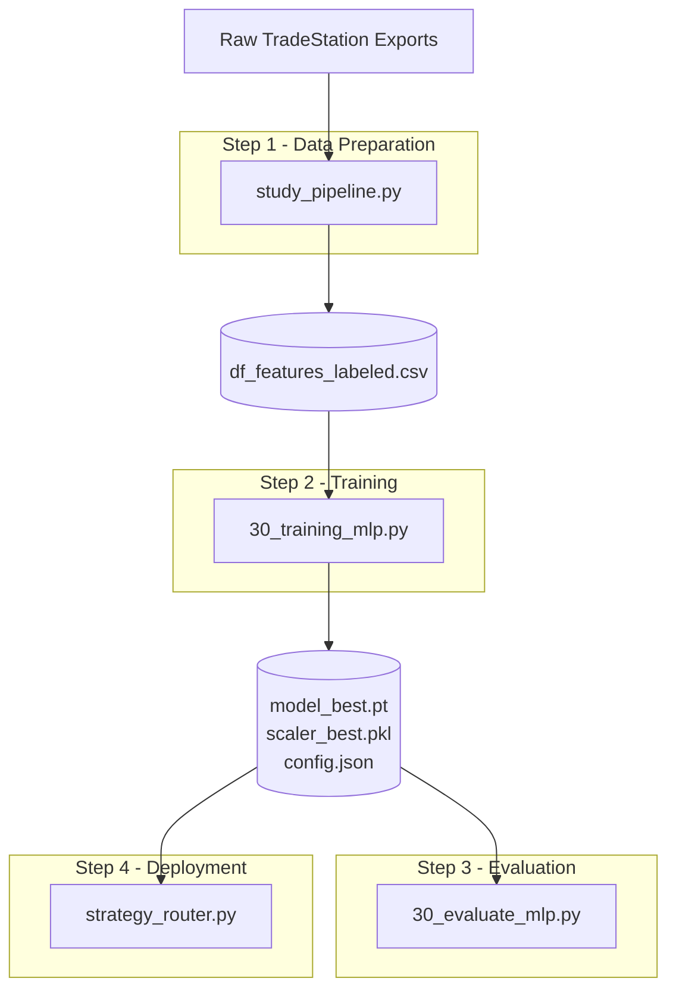

# How to Train the Meta-Labeling Model
> **What:** End-to-end guide for the offline ML pipeline — from raw TradeStation exports to trained model weights ready for live inference.

---

## Overview



---

## Step 1 — Export Raw Data from TradeStation

You need two files from TradeStation:

| File | What it is | Where to save |
|---|---|---|
| `trades_30.csv` | Trade log export — all MA2CrossLE entries with P&L | Desktop |
| `data_30.txt` | 30-second bar data export — OHLCV + Up/Down volume | Downloads |

**How to export the trade log:**
1. Open TradeStation → Strategy Performance Report
2. Export as CSV (includes Date/Time, Signal, % Profit columns)

**How to export bar data:**
1. Open the 30-second bar chart with the strategy applied
2. Export → Historical Data → CSV

---

## Step 2 — Build the Labeled Dataset

```bash
cd training_mlp
python study_pipeline.py
```

This script:
1. Loads the bar data and parses OHLCV + Up/Down volume
2. Loads the trade log and applies **meta-labeling** — tags each MA2CrossLE entry as `1` (profitable) or `0` (loss)
3. Engineers all 13 microstructure features from the bars
4. Merges features + labels on timestamp
5. Exports `training_mlp/df_features_labeled.csv`

Expected output:
```
Loading bars...
Loading trades...
Engineering features...
Merging and exporting...
Saved → df_features_labeled.csv

Shape     : (17761, 15)
Label dist:
1    8984
0    8777
```

**INJECTIBLE parameters** at the top of `study_pipeline.py`:

| Parameter | Default | Description |
|---|---|---|
| `signal_name` | `"MA2CrossLE"` | Which strategy signal to meta-label |
| `OPEN_TIME` | `"09:30:00"` | Market open time for session features |
| `TRADES_FILE` | Desktop path | Path to TradeStation trade log CSV |
| `BARS_FILE` | Downloads path | Path to bar data CSV |
| `OUTPUT_FILE` | `"df_features_labeled.csv"` | Output path |

---

## Step 3 — Train the Model

```bash
cd training_mlp
python 30_training_mlp.py
```

This script:
1. Loads `df_features_labeled.csv`
2. Splits into CV pool (90%) + held-out test set (10%) with an 80-bar embargo gap
3. Runs 5-fold purged-embargo walk-forward cross-validation
4. Trains an MLP on each fold, saves per-fold weights and scalers
5. Selects the best fold by validation AUC
6. Saves `model_best.pt` and `scaler_best.pkl` under the configured strategy model directory

Expected output:
```
Device    : cpu
CV pool   : 15905 samples
Test      : 1776 samples — frozen until evaluate.py

Folds: 100%|████████| 5/5
  Fold 5  acc=0.5834 f1=0.5935 auc=0.6101

Best fold : 4  (val AUC 0.6386)
Default artifact directory: `training_mlp/strategies/MA2CrossLE/model/mlp_baseline`
```

> Requires a W&B account for experiment tracking. To skip W&B, comment out the `wandb.*` calls.

**INJECTIBLE parameters** at the top of `30_training_mlp.py`:

| Parameter | Default | Description |
|---|---|---|
| `DATA_FILE` | `"df_features_labeled.csv"` | Input dataset |
| `MODEL_DIR` | `"strategies/MA2CrossLE/model/mlp_baseline"` | Default artifact directory from `pipeline_paths.py` |
| `EPOCHS` | `100` | Max training epochs per fold |
| `BATCH_SIZE` | `64` | Mini-batch size |
| `LR` | `1e-3` | Peak learning rate |
| `PATIENCE` | `15` | Early stopping patience |
| `N_SPLITS` | `5` | Number of CV folds |
| `PURGE_BARS` | `20` | Bars purged at each fold boundary |
| `EMBARGO_BARS` | `60` | Bars embargoed after each fold |
| `TEST_SIZE` | `0.10` | Fraction held out as frozen test |

---

## Step 4 — Evaluate on the Held-Out Test Set

```bash
cd training_mlp
python 30_evaluate_mlp.py
```

This script loads `model_best.pt` and `scaler_best.pkl`, runs them on the frozen `X_test.npy` / `y_test.npy`, and prints the final metrics. **Run this only once** — the test set is meaningless if you use it to make training decisions.

Expected output:
```
── Test results ─────────────────────────────────────
              precision  recall  f1-score  support
           0     0.5278  0.4146    0.4643      877
           1     0.5889  0.6938    0.6371      899

acc: 0.5822  f1: 0.6123  auc: 0.6203

Baseline acc : 0.5058
Test acc     : 0.5822  (↑ beats baseline)
```

Results are saved to the configured strategy model directory as `results_test.json`.

---

## Step 5 — Deploy for Live Inference

Once satisfied with the test results, the trained artifacts are ready to use in the live pipeline:

```bash
# From project root, after Redis and the feature service are running
python -m inference.strategy_router
```

`strategy_router.py` loads the mapped strategy's `model_best.pt`,
`scaler_best.pkl`, and `config.json` once at startup. It invokes them only for
matching trade candidates. See [[how_to_run_pipeline]] for live startup.

---

## Artifacts Produced

By default, all are saved to `training_mlp/strategies/MA2CrossLE/model/mlp_baseline/`:

| File | Description |
|---|---|
| `model_best.pt` | Production model weights (best fold by val AUC) |
| `scaler_best.pkl` | StandardScaler fitted on best fold's training data |
| `model_fold_{1-5}.pt` | Per-fold model weights |
| `scaler_fold_{1-5}.pkl` | Per-fold scalers |
| `X_test.npy` | Frozen test features (scaled by best scaler) |
| `y_test.npy` | Frozen test labels |
| `config.json` | All hyperparameters and dataset metadata |
| `results_cv.csv` | Per-fold CV metrics |
| `results_test.json` | Final held-out test metrics |

---

## Dependencies

```bash
pip install -r training_mlp/requirements.txt
```

Key packages: `torch`, `scikit-learn`, `pandas`, `numpy`, `wandb`, `tqdm`
