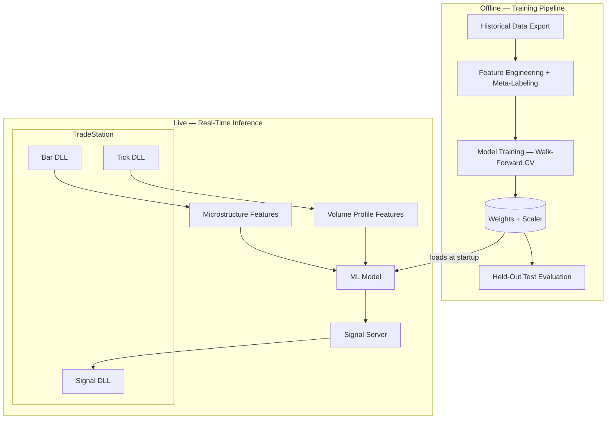

# GNET — Infraestructura de Trading Algorítmico con Capa de IA
### El puente entre el swing trading estadístico y la ejecución intradiaria con ML

---

## El contexto: dónde está el gap

El proceso actual — backtest estadístico, validación, deploy de un bot estático — es correcto. La lógica es sólida. El problema no es la estrategia.

**El problema es que un bot estático no puede adaptarse a lo que está pasando en el mercado ahora mismo.**

Un bot estático dispara la misma regla el lunes con volumen institucional a las 9:45 que el viernes a las 15:50 sin liquidez. No distingue contexto. No escala a intradiario porque a 30 segundos el ruido supera a una regla fija — demasiadas señales, la gran mayoría sin contexto favorable.

Lo que falta no es más backtest. Lo que falta es un **pipeline que conecte esa inteligencia estadística existente con ejecución intradiaria adaptativa en tiempo real.** Eso es GNET.

---

## ¿Qué es GNET?

Un pipeline de datos de baja latencia que extrae barras y ticks de TradeStation, calcula 21 features de microestructura en tiempo real, las expone a cualquier modelo de ML, y devuelve la decisión como orden ejecutable — **en menos de 1 barra de 30 segundos**.

La señal de la estrategia existente es el **trigger**. El pipeline decide si el contexto intradiario actual es favorable para ejecutarla.

---

## Por qué el swing estadístico y el intradiario con ML son complementarios

| | Swing / bot estático | GNET intradiario |
|---|---|---|
| Timeframe | Días / semanas | 30 segundos — horas |
| Señal | Regla fija basada en estadística | La misma señal + contexto de microestructura |
| Adaptación | Ninguna — misma regla siempre | Probabilidad dinámica por barra |
| Oportunidades por día | 1–5 | 50–200 filtradas por el modelo |
| Cambio de parámetros | Requiere re-backtest | El modelo se reentrena |
| Escalable a otros instrumentos | Rebuild manual | Misma arquitectura, distinto feed |

El swing estadístico da el **qué**. GNET da el **cuándo** dentro del día. No son competidores — son capas distintas de la misma operación.

---

## Lo que el pipeline produce: 21 features de microestructura en tiempo real

Lo que ningún bot estático evalúa al momento de disparar:

**Capa 1 — Transformer Features (13 features, desde barras de 30s)**

| Feature | Descripción |
|---|---|
| `parkinson_vol_{5,15,30}` | Volatilidad del rango High/Low en 3 ventanas — detecta cambios de régimen |
| `ofi_{5,15,30}` | Order Flow Imbalance — presión compradora vs vendedora neta, acotada [−1, 1] |
| `volume_percentile` | Percentil del volumen actual vs los últimos 60 bares |
| `volume_momentum` | Aceleración o desaceleración de actividad |
| `amihud_illiquidity` | Impacto de precio por dólar operado — detecta iliquidez |
| `vwap_distance` | Distancia al precio justo (VWAP) normalizada por ATR |
| `minutes_since_open` | Minutos desde apertura — el mercado se comporta distinto a cada hora |
| `is_first_last_30min` | Apertura / cierre de sesión — zonas de comportamiento diferenciado |
| `day_of_week` | Patrones intra-semanales documentados en futuros |

**Capa 2 — Volume Profile (8 features, desde flujo de ticks — en producción)**

| Feature | Descripción |
|---|---|
| `poc_distance` | Distancia al Point of Control de la sesión |
| `poc_concentration` | Concentración del volumen institucional |
| `va_width` / `va_position` | Tamaño y posición dentro del Value Area (70% del volumen) |
| `vol_above_poc_ratio` | Sesgo direccional de volumen arriba vs abajo del POC |
| `profile_entropy` / `profile_kurtosis` | Distribución del perfil — consolidación vs tendencia |
| `poc_migration` | Movimiento del POC entre barras — momentum institucional |

**21 features disponibles en Redis cada barra. Cualquier modelo que el equipo conecte los tiene listos como inputs.**

---

## El modelo actual: un MLP como prueba de concepto

La cabeza de ML actual es un **MLP de 2 capas** — el modelo más básico posible — conectado al pipeline sobre 17,761 trades reales de @ES. Se eligió deliberadamente así para demostrar que **incluso el modelo más simple conectado a esta infraestructura supera al bot estático**.

Salida: una **probabilidad entre 0 y 1** por barra. No una regla binaria — contexto cuantificado.

Entrenado con validación walk-forward estrictamente temporal (nunca ve el futuro), purge de 10 min y embargo de 30 min en cada fold para eliminar data leakage. AUC promedio de **0.614** en validación cruzada, mejorando fold sobre fold (0.596 → 0.639) conforme crece el dataset.

---

## Resultado en test set — datos completamente congelados

**1,776 señales del período de prueba, nunca vistas durante el entrenamiento.**

|  | Bot estático | MLP sobre GNET |
|---|---|---|
| Señales ejecutadas | 1,776 | **1,059** |
| Trades ganadores | 899 | **624** |
| Trades perdedores | 877 | **435** |
| **Trades netos ganadores** | **+22** | **+189** |
| Win rate | 50.6% | **58.9%** |

El bot estático terminó con **+22 trades netos** — estadísticamente casi un empate contra el mercado. El MLP más simple sobre el pipeline generó **+189**, descartando 717 señales sin contexto favorable.

**En dinero — 1 contrato @ES, $100 promedio por trade**

| | Resultado neto |
|---|---|
| Bot estático: 22 × $100 | **+$2,200** |
| MLP sobre GNET: 189 × $100 | **+$18,900** |
| **Diferencia** | **+$16,700 en el mismo período** |

> *$100/trade = 2 puntos en @ES — asunción conservadora. Esto es el modelo más básico. Un modelo más sofisticado tiene headroom directo de mejora sobre el mismo pipeline.*

---

## Proyección a escala: de swing a intradiario

El dataset de prueba cubre ~50 días de trading (1,776 señales / ~35 señales por día). Con el modelo filtrando ~60% de las señales, **el sistema ejecuta aproximadamente 21 trades por día** — contra 1–5 del swing.

**Por contrato @ES, con win rate 58.9% y $100 promedio por trade:**

| Período | Trades ejecutados | Esperanza por trade | **Resultado neto estimado** |
|---|---|---|---|
| Día | ~21 | +$17.80 | **+$374** |
| Mes (22 días) | ~462 | +$17.80 | **+$8,228** |
| Año (250 días) | ~5,250 | +$17.80 | **+$93,450** |

**Comparado con la misma estrategia en swing (2–3 trades/día):**

| Período | Swing estático | GNET intradiario | Diferencia |
|---|---|---|---|
| Mes | ~$1,000 | ~$8,200 | **+$7,200** |
| Año | ~$11,000 | ~$93,000 | **+$82,000** |

> *Asunciones: 35 señales MA/día (consistente con el dataset), 60% ejecutadas por el modelo, $100 ganancia/pérdida promedio por trade, 1 contrato. Con 5 contratos los números se multiplican directamente. La esperanza por trade ($17.80) sale de 58.9% wins × $100 − 41.1% losses × $100.*

La diferencia no es solo el rendimiento por trade — **es el volumen de oportunidades filtradas que el swing nunca captura**. Un bot estático en swing deja el 90% del día sin operar. GNET opera cuando el contexto lo justifica, las veces que el contexto lo justifica.

---

## Sharpe y Sortino — test set

Calculados sobre los 1,776 trades del test set, agregados a P&L diario (~35 trades/día bot, ~21 trades/día modelo). Asunción: ganancia promedio = pérdida promedio = $100 por trade, trades independientes entre sí.

| | Bot estático | GNET modelo |
|---|---|---|
| Esperanza por trade | +$1.24 | +$17.85 |
| **Sharpe anualizado** | **1.16** | **13.19** |
| **Sortino anualizado** | **1.66** | **20.26** |

El bot con Sharpe de 1.16 es un sistema funcional — la mayoría de estrategias retail no llegan a 1.0. El modelo eleva el Sharpe a 13.19 y el Sortino a 20.26, principalmente porque filtra las pérdidas y concentra la operativa en contextos de alta probabilidad, reduciendo el drawdown diario relativo al retorno esperado.

> *Nota: los valores absolutos del modelo son altos por la asunción de payoff simétrico y trades independientes. En producción, comisiones, slippage y correlación intradiaria los reducen — pero el diferencial relativo entre bot y modelo se mantiene.*

---

## Por qué no existe esto como producto comercial

| Capa | Qué implica |
|---|---|
| **Extracción** | C++ — DLLs nativas de Windows con interfaz directa a TradeStation |
| **Arquitectura** | TCP/IP, Redis streams, 7 microservicios concurrentes |
| **Microestructura** | OFI, Amihud, Parkinson, Volume Profile — investigación académica financiera |
| **Machine Learning** | Meta-labeling, validación temporal, purge/embargo |
| **Infraestructura** | Docker, PyTorch, scikit-learn, toolchain nativo x86 |

Las firmas institucionales construyen esto internamente con equipos especializados. GNET es esa misma arquitectura — modular, extensible, ya construida.

---

## Lo que se puede construir encima

La infraestructura está lista. Las siguientes iteraciones son solo **cambiar la cabeza de ML**:

- **Conectar la estrategia swing existente como señal** — el pipeline recibe cualquier trigger y lo filtra con contexto intradiario
- **Volume Profile al modelo** — 8 features ya en Redis, reentrenar con 21 inputs es el siguiente paso
- **Modelos más potentes** — LSTM, Transformer, Ensemble — misma arquitectura, distinto modelo
- **Position sizing dinámico** — la probabilidad del modelo escala el tamaño de posición (Kelly fraccional)
- **Múltiples instrumentos** — NQ, CL, GC como extensiones directas sin rediseño
