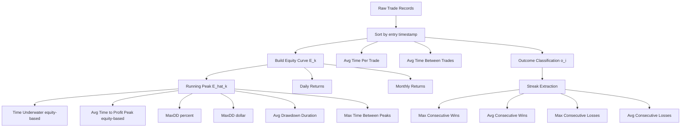

# Backtest Metrics — Mathematical Reference

> **Purpose:** Formal definitions of all mathematical operations needed to compute each backtest KPI before implementation.
> **Notation:** $T$ = set of all trades, $N$ = total number of trades, $t_i$ = individual trade index, $P$ = price series, $E$ = equity curve.
> **Data model:** This reference assumes **closed-trade (realized) data only** — each trade contributes entry/exit timestamps and realized PnL. The equity curve updates on trade close, **not** mark-to-market. No metric consumes the intra-trade price path. See §0 for the full input schema.

---

## 0. Input Schema & Prerequisites

### 0.1 Input Schema (Data Contract)

The entire reference depends on exactly two inputs: a scalar **initial capital** and an ordered list of **closed-trade records**.

**Required schema (minimum to compute every metric):**

1. `initial_capital` — `float > 0`
2. `trades` — list, sorted ascending by `entry_ts`, where each trade has:
   - `entry_ts` — `datetime`
   - `exit_ts` — `datetime`
   - `pnl` — `float` (realized PnL in \$)

**Optional metadata (stored but read by no metric):** `direction`, `entry_price`, `exit_price`, `pnl_pct`.

The tables below give the full field list with symbols and which metric consumes each.

**Scalar:**

| Symbol | Field | Type | Notes |
|---|---|---|---|
| $C_0$ | `initial_capital` | `float > 0` | Equity baseline; $E_0 = C_0$ |

**Per closed trade $t_i$:**

| Symbol | Field | Type | Required? | Consumed by |
|---|---|---|---|---|
| $t_i^{entry}$ | `entry_ts` | `datetime` | **required** | §2.1, §2.2 |
| $t_i^{exit}$ | `exit_ts` | `datetime` | **required** | §2.1, §2.2; timestamps each equity point |
| $t_i^{pnl}$ | `pnl` | `float` | **required** | equity curve → §1, §2.3, §2.4, §3, §4; outcome sign §5 |
| $\text{dir}_i$ | `direction` | `+1 / −1` | optional | none (metadata) |
| $t_i^{price\_entry}$ | `entry_price` | `float` | optional | none (metadata) |
| $t_i^{price\_exit}$ | `exit_price` | `float` | optional | none (metadata) |
| $t_i^{pnl\%}$ | `pnl_pct` | `float` | optional | none (returns are derived from equity, not this) |

> **Minimal contract:** `{initial_capital, [(entry_ts, exit_ts, pnl), …]}`. The optional fields are standard trade metadata worth storing, but **no metric in this document reads them** — returns, drawdown, underwater, and peak metrics are all derived from the equity curve, which needs only `pnl` (values) and `exit_ts` (time axis).

**Python form of the contract:**

```python
from dataclasses import dataclass
from datetime import datetime

@dataclass(frozen=True)
class Trade:
    entry_ts: datetime      # required
    exit_ts: datetime       # required
    pnl: float              # required ($)
    direction: int = 0      # optional metadata: +1 long, -1 short
    entry_price: float | None = None  # optional metadata
    exit_price: float | None = None   # optional metadata
    pnl_pct: float | None = None      # optional metadata

@dataclass(frozen=True)
class BacktestInput:
    initial_capital: float          # C_0 > 0
    trades: list[Trade]             # sorted ascending by entry_ts
```

**Preconditions:** trades sorted ascending by `entry_ts`; `initial_capital > 0`; an empty `trades` list yields all-`None` metrics (§8).

### 0.2 Derived Structures

Everything below is computed from the contract above — these are not inputs.

| Symbol | Structure | Built from |
|---|---|---|
| $E_k$ | Equity curve, indexed by trade close | $C_0$ + cumulative `pnl` |
| $E_d, E_m$ | Daily / monthly equity snapshots | $E_k$ bucketed by `exit_ts` |
| $\hat{E}_k$ | Running peak | $E_k$ |
| $S$ | Indices of equity all-time highs | $E_k$ |
| $o_i$ | Outcome sequence ($+1/-1/0$) | sign of `pnl` |
| $W, L$ | Winning / losing streak-length sets | $o_i$ |

**Equity curve definition:**

$$E_k = C_0 + \sum_{i=1}^{k} t_i^{pnl}, \quad k \in [0, N], \quad E_0 = C_0$$

This is a **realized** equity curve indexed by trade close, so all drawdown (§4) and peak (§3) metrics measure closed-trade behavior and understate true intra-trade drawdown.

---

## 1. Returns Metrics

### 1.1 Initial Capital

$$C_0 \in \mathbb{R}^+$$

No computation — a scalar input parameter to the backtest.

### 1.2 Daily Returns

Let $E_d$ be the equity value at end of day $d$.

$$R_d = \frac{E_d - E_{d-1}}{E_{d-1}} \times 100$$

- **Input:** Daily equity snapshots $\{E_0, E_1, \ldots, E_D\}$
- **Output:** Series $\{R_1, R_2, \ldots, R_D\}$ in %
- **Note:** If no trade closes on day $d$, then $E_d = E_{d-1}$ and $R_d = 0$.

### 1.3 Monthly Returns

Let $E_m$ be the equity value at end of month $m$.

$$R_m = \frac{E_m - E_{m-1}}{E_{m-1}} \times 100$$

- **Input:** Monthly equity snapshots (last trading day of each month)
- **Output:** Series $\{R_1, R_2, \ldots, R_M\}$ in %
- **Alternative (compounding from daily):**

$$R_m = \left(\prod_{d \in \text{month } m} \left(1 + \frac{R_d}{100}\right) - 1\right) \times 100$$

---

## 2. Time-Based Metrics

### 2.1 Average Time Per Trade

Duration of trade $i$:

$$\Delta_i = t_i^{exit} - t_i^{entry} \quad \text{(in chosen time unit)}$$

Mean duration:

$$\overline{\Delta} = \frac{1}{N} \sum_{i=1}^{N} \Delta_i$$

- **Unit:** seconds → convert to hours or days by dividing by $3600$ or $86400$
- **Edge case:** If $t_i^{exit} = t_i^{entry}$ (same-bar close), $\Delta_i = 0$; include in mean.

### 2.2 Average Time Between Trades

Gap between consecutive trades:

$$G_i = t_{i+1}^{entry} - t_i^{exit}, \quad i \in [1, N-1]$$

Mean gap:

$$\overline{G} = \frac{1}{N-1} \sum_{i=1}^{N-1} G_i$$

- **Requires:** Trades sorted ascending by $t_i^{entry}$.
- **Note:** $G_i < 0$ indicates overlapping trades (only possible if strategy allows simultaneous positions).

### 2.3 Time Underwater (Equity-Based)

The time the **equity curve** spends below its prior high-water mark (running peak $\hat{E}_k$, see §4.1). This is the standard definition of "time underwater" and requires only the closed-trade equity curve.

Let $\delta k$ be the snapshot interval of the equity series (e.g. one day, or one trade index).

**Total time underwater:**

$$U_{total} = \sum_{k=1}^{N} \mathbf{1}\!\left[E_k < \hat{E}_k\right] \cdot \delta k$$

**Percentage of backtest spent underwater:**

$$U_{\%} = \frac{U_{total}}{T_{total}} \times 100$$

Where $T_{total}$ is total backtest duration and $\mathbf{1}[\cdot]$ is the indicator function.

- **Relationship:** $U_{total}$ equals the sum of all drawdown-period durations in §2.4; $\overline{DD_{dur}}$ is $U_{total}$ divided by the number of distinct drawdown periods.
- **Edge case:** If equity never falls below its peak, $U_{total} = 0$.

### 2.4 Average Drawdown Duration

A drawdown period $d_j$ starts when $E$ falls below a prior peak and ends when $E$ recovers to that peak.

Let $\{d_1, d_2, \ldots, d_K\}$ be the set of all drawdown periods with durations $\{L_1, L_2, \ldots, L_K\}$.

$$\overline{DD_{dur}} = \frac{1}{K} \sum_{j=1}^{K} L_j, \quad K > 0$$

- **Algorithm to find drawdown periods:**
  1. Track running peak: $\hat{E}_k = \max(E_0, E_1, \ldots, E_k)$
  2. Drawdown active when $E_k < \hat{E}_k$
  3. Period starts at first $k$ where $E_k < \hat{E}_k$, ends when $E_k = \hat{E}_k$ again
- **Edge case ($K = 0$):** No drawdown ever occurred → $\overline{DD_{dur}}$ is undefined; return `None`.
- **Open drawdown:** If the series ends while still underwater (never recovers to peak), close the final period at the last index. Document whether this partial period counts toward the average (default: **yes**, closed at series end).

---

## 3. Equity Peak Metrics

Both metrics in this section operate on the equity curve's all-time highs. Define the **ordered set** of indices where $E$ sets a new all-time high:

$$S = \left\{\, k : E_k > \max_{0 \le m < k} E_m \,\right\}, \qquad s_1 < s_2 < \cdots < s_J \ \text{(ascending enumeration of } S)$$

Inter-peak intervals (time the curve takes to establish each successive new high):

$$I_j = s_{j+1} - s_j, \quad j \in [1, J-1]$$

### 3.1 Average Time to Profit Peak (Mean Equity Peak Interval)

Mean of the inter-peak intervals — the average time the equity curve takes to reach a new high:

$$\overline{I} = \frac{1}{J-1} \sum_{j=1}^{J-1} I_j$$

- **Interpretation:** Lower $\overline{I}$ = the strategy keeps making new equity highs frequently.
- **Edge case:** If $J = 1$ (a new high never occurs after $E_0$), there are no intervals → undefined; return `None`.

### 3.2 Maximum Time Between Equity Peaks (Max Equity Peak Interval)

Maximum of the same inter-peak intervals:

$$I_{max} = \max_{j} \, I_j$$

- **Note:** $I_{max}$ corresponds to the longest period without a new equity high (plateau or drawdown).
- **Edge case:** If $J = 1$ (only the initial value is ever the peak), then $I_{max}$ = total backtest duration.

---

## 4. Drawdown Metrics

### 4.1 Running Peak

$$\hat{E}_k = \max(E_0, E_1, \ldots, E_k)$$

### 4.2 Drawdown at Each Point (%)

$$DD_k = \frac{\hat{E}_k - E_k}{\hat{E}_k} \times 100$$

- $DD_k \geq 0$ always.
- $DD_k = 0$ when $E_k$ is at an all-time high.

### 4.3 Maximum Drawdown (%)

$$MaxDD_{\%} = \max_{k} \, DD_k = \max_{k} \left(\frac{\hat{E}_k - E_k}{\hat{E}_k}\right) \times 100$$

**Equivalent trough-based formulation:**

$$MaxDD_{\%} = \max_{i \leq j} \left(\frac{E_i - E_j}{E_i}\right) \times 100$$

Where $i$ is the peak index and $j$ is the subsequent trough index. The two formulations are equal because, for any fixed trough $j$, the maximizing $E_i$ is the running peak $\hat{E}_j$. **Assumes $E_k > 0$ throughout** (monotonicity of the ratio in $E_i$ breaks if equity reaches $\le 0$).

### 4.4 Maximum Drawdown ($)

$$MaxDD_{\$} = \max_{k} \left(\hat{E}_k - E_k\right)$$

- **Relationship:** $MaxDD_{\$} \neq MaxDD_{\%} \times C_0$. Each must be computed independently since the peak equity $\hat{E}_k$ differs between occurrences.

---

## 5. Win/Loss Streak Metrics

### 5.1 Trade Outcome Classification

$$o_i = \begin{cases} +1 & \text{if } t_i^{pnl} > 0 \quad \text{(win)} \\ -1 & \text{if } t_i^{pnl} < 0 \quad \text{(loss)} \\ 0 & \text{if } t_i^{pnl} = 0 \quad \text{(breakeven)} \end{cases}$$

> **Design decision:** Breakeven trades ($o_i = 0$) break streaks by default. Document this assumption per implementation.

### 5.2 Streak Extraction Algorithm

Given outcome sequence $O = \{o_1, o_2, \ldots, o_N\}$, extract runs of consecutive same-sign values:

1. Initialize: current streak = 1, streak type = $o_1$, collect all streaks by type
2. For $i = 2$ to $N$: if $o_i = o_{i-1}$ → increment streak; else → save streak, reset to 1
3. Save final streak on loop end

Let $W = \{w_1, w_2, \ldots, w_p\}$ = set of all winning streak lengths  
Let $L = \{l_1, l_2, \ldots, l_q\}$ = set of all losing streak lengths

### 5.3 Maximum Consecutive Losses

$$MaxConsecLoss = \max_{j} \, l_j, \quad q > 0$$

### 5.4 Average Consecutive Losses

$$\overline{ConsecLoss} = \frac{1}{q} \sum_{j=1}^{q} l_j, \quad q > 0$$

- **Edge case ($q = 0$):** No losing streaks → undefined; return `None`.

### 5.5 Maximum Consecutive Wins

$$MaxConsecWin = \max_{j} \, w_j, \quad p > 0$$

### 5.6 Average Consecutive Wins

$$\overline{ConsecWin} = \frac{1}{p} \sum_{j=1}^{p} w_j, \quad p > 0$$

- **Edge case ($p = 0$):** No winning streaks → undefined; return `None`.

---

## 6. Computation Order & Dependencies



---

## 7. Metric Summary with Formulas

| Metric | Formula | Dependencies |
|---|---|---|
| Daily Returns | $R_d = \frac{E_d - E_{d-1}}{E_{d-1}} \times 100$ | Equity curve |
| Monthly Returns | $R_m = \frac{E_m - E_{m-1}}{E_{m-1}} \times 100$ | Equity curve |
| Avg Time Per Trade | $\overline{\Delta} = \frac{1}{N}\sum \Delta_i$ | Trade records |
| Avg Time Between Trades | $\overline{G} = \frac{1}{N-1}\sum G_i$ | Trade records (sorted) |
| Time Underwater | $U_{total} = \sum_k \mathbf{1}[E_k < \hat{E}_k]\,\delta k$ | Equity curve, running peak |
| Avg Drawdown Duration | $\overline{DD_{dur}} = \frac{1}{K}\sum L_j$ | Equity curve, running peak |
| Avg Time to Profit Peak | $\overline{I} = \frac{1}{J-1}\sum I_j$ | Equity all-time highs |
| Max Time Between Peaks | $I_{max} = \max_j I_j$ | Equity all-time highs |
| MaxDD (%) | $\max_k \frac{\hat{E}_k - E_k}{\hat{E}_k} \times 100$ | Running peak |
| MaxDD ($) | $\max_k (\hat{E}_k - E_k)$ | Running peak |
| Max Consecutive Losses | $\max_j l_j$ | Streak extraction |
| Avg Consecutive Losses | $\frac{1}{q}\sum l_j$ | Streak extraction |
| Max Consecutive Wins | $\max_j w_j$ | Streak extraction |
| Avg Consecutive Wins | $\frac{1}{p}\sum w_j$ | Streak extraction |

---

## 8. Assumptions & Edge Cases

| Scenario | Handling |
|---|---|
| No trades ($N = 0$) | All metrics undefined / return `None` |
| Single trade ($N = 1$) | $\overline{G}$ undefined; streaks = single element |
| Simultaneous positions | $G_i < 0$ possible; document if strategy allows |
| Breakeven trades ($pnl = 0$) | Breaks streaks by default |
| No drawdown ($K = 0$) | $\overline{DD_{dur}}$ undefined; return `None` |
| No win/loss streaks ($p = 0$ or $q = 0$) | Corresponding avg/max undefined; return `None` |
| Single equity peak ($J = 1$) | $\overline{I}$ undefined; $I_{max}$ = total duration |
| Open drawdown at series end | Close final period at last index; counts toward average by default |
| Realized vs mark-to-market equity | Equity updates on trade close only → drawdown and peak metrics understate true intra-trade behavior |
| Bar / snapshot resolution | All time computations depend on chosen interval $\delta k$ |
